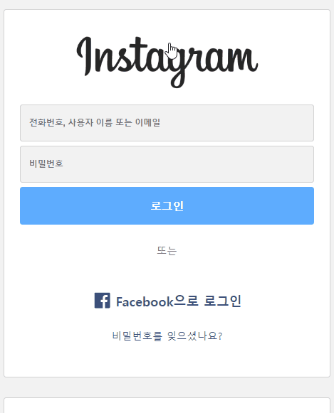

### **[Firebase hosting을 이용한 배포 사이트](https://wanted-pre-assignment.web.app/)**

# 1. Login

<p align="center"></p>

```js
// context/auth.js
const [logInState, setLogInState] = useState(false);

const loginHandler = (id) => {
  localStorage.setItem('isLoggedIn', '1');
  localStorage.setItem('id', id);
  setLogInState(true);
};

const logoutHandler = () => {
  localStorage.removeItem('isLoggedIn');
  localStorage.removeItem('id');
  setLogInState(false);
};

useEffect(() => {
  if (localStorage.isLoggedIn === '1') {
    setLogInState(true);
  }
}, []);
```

1. **loginState**

   - 로그인 상태는 앱 전체에서 접근할 수 있어야 하는 데이터라고 생각했기 때문에, 이 상태를 긴 prop chain으로 전달하지 않기 위해 context를 이용하였다.

2. **useEffect**
   - localStorage에서 데이터를 읽는 작업은 side effect이므로 useEffect를 사용하였다.
   - 앱이 처음 실행될 때에만 로그인 여부를 확인하고, 상태를 업데이트하도록 Dependencies에 아이템을 전달하지 않았다.

# 2.GNB


```js
// mainPage
const MainPage = (props) => {
  return (
    <main>
      <Header />
      <Feeds />
    </main>
  );
};
```

```css
.header {
  border-bottom: 1px solid var(--color-border);
  background-color: white;
  position: sticky;
  top: 0;
}

.header-navbar {
  display: none;
}

@media screen and (min-width: 576px) {
  .header-navbar {
    display: block;
  }
}
```

1. 모바일을 기준으로 스타일링 코드를 먼저 작성하고, 576px 이상(모바일 가로 너비)일 때 navigation bar를 보여주도록 작성했다.
2. Header 컴포넌트에 sticky를 적용하여 main 태그를 기준으로 가장 상위에 헤더가 고정될 수 있도록 했다.

# 3. Validation

<p align="center"></p>

## 3-1. RegularExpression & useValidation

```js
// hooks/use-validation
const useValidation = (props) => {
  const checkValid = useCallback((input, regExp) => {
    if (!input) return null;
    if (input) return regExp.test(input);
  }, []);

  return { checkValid };
};

//loginForm
const [idValue, setIdValue] = useState('');
const [pwValue, setPwValue] = useState('');
const { checkValid } = useValidation();

const idChangeHandler = (e) => {
  setIdValue(e.target.value);
};

const pwChangeHandler = (e) => {
  setPwValue(e.target.value);
};

const isIdValid = checkValid(
  idValue,
  new RegExp('^[a-zA-Z0-9._:$!%-]+@[a-zA-Z0-9.-]+.[a-zA-Z]$')
);
const isPwValid = checkValid(
  pwValue,
  new RegExp('^(?=.*[a-z])(?=.*[A-Z])(?=.*[0-9])(?=.*[!@#$%^&*])(?=.{8,})')
);
```

1. 정규표현식의 유효성을 검사하는 코드를 훅으로 분리했다.
2. **id & pw value**
   - 사용자가 값을 입력할 때 마다 state를 업데이트했다.
   - value가 업데이트 될 때마다 어차피 컴포넌트를 재평가하기 때문에, 유효성 검사 결과를 다른 state로 관리하지는 않았다.
   - useEffect의 클린업 함수를 이용해서 사용자가 값을 타이핑 한 뒤 일정 시간이 지났을 때에만 유효성 검사를 진행하는 방법도 고려해 보았다.

## 3-2. Dynamic Styling

```jsx
const idClasses = `${isIdValid === false ? styles['invalid'] : ''}  ${
  isIdValid ? styles['valid'] : ''
}`;
```

1. className을 동적으로 지정해서 유효성 검사 결과에 따라 다른 스타일링을 적용하였다.
2. 유효성이 false일 때만 invalid 클래스를 지정해서, 입력값이 비어있을 때(null)에는 기본 스타일이 지정되도록 만들었다.

# 4. Routing

```js
// app
function App() {
  return (
    <Routes>
      <Route path="/" element={<LoginPage />} />
      <Route path="/main" element={<MainPage />} />
    </Routes>
  );
}

// loginForm
{
  context.isLoggedIn && (
    <Routes>
      <Route path="*" element={<Navigate to="/main" replace />} />
    </Routes>
  );
}

// menu
<li onClick={context.onLogout} className={styles['menu-item']}>
  <Link to="/">
    <LogoutIcon size="24" />
  </Link>
</li>;
```

1. 경로에 따라 어떤 컴포넌트를 렌더링할 것인지 결정했다.
2. 로그인을 마치면 main 페이지로 redirect한다.
3. 로그아웃을 클릭하면 login 페이지를 렌더링한다.
4. +) main 라우트를 protected page로 만들면 로그인이 완료된 상태에서만 접근할 수 있다.

# 5. Feeds

## 5-1. useHttp

```jsx
const [feeds, setFeeds] = useState([]);
const { isLoading, error, sendRequest } = useHttp();

useEffect(() => {
  sendRequest({ url: 'data/data.json' }, (data) => setFeeds([...data.feeds]));
}, [sendRequest]);

// hooks/ use-http
const [isLoading, setLoading] = useState(null);
const [error, setError] = useState(null);
const sendRequest = useCallback(async (config, transformData) => {
  try {
    setLoading(true);
    setError(null);
    const response = await fetch(config.url, {
      method: config.method ? config.method : 'GET',
      headers: config.headers ? config.headers : {},
      body: config.body ? JSON.stringify(config.body) : null,
    });

    if (!response.ok) throw new Error('Request Error!');

    const data = await response.json();
    transformData(data);
  } catch (e) {
    setError(e.message);
  }
  setLoading(false);
}, []);
```

1. 실제 백엔드 어플리케이션과 통신을 하는 것은 아니지만, http 통신에 재사용 할 수 있도록 훅으로 분리했다.
2. **sendRequest**
   - 함수가 불필요하게 재생성되는 것을 막기 위해 useCallback을 사용했다.
   - dependency를 단순하게 관리하기 위해, 함수 내부에서 인자로 받은 데이터만을 사용하도록 코드를 작성했다.

## 5-2. add comments

<p align="center"></p>

```js
// commentInput
const commentInput = useRef();
const submitHandler = (e) => {
  e.preventDefault();

  const comment = commentInput.current.value;
  comment.trim().length > 0 &&
    props.commentHandler({
      userName: localStorage.getItem('id'),
      contents: comment,
    });

  commentInput.current.value = '';
};
```

1. 공백을 제외하고 댓글의 length가 1 이상일 때에만 댓글을 등록할 수 있게 만들었다.
2. 댓글을 등록할 때 userName이 나타나도록, 로그인 시 localStorage에 등록한 id를 이용하였다.

## 5-3. lazy loading

<p align="center"></p>

```js
// feedMain
const [isImageLoaded, setImageLoad] = useState(false);
const imageRef = useRef();

const onLoadHandler = () => {
  if (imageRef.current && imageRef.current.complete) {
    setImageLoad(true);
  }
};

useEffect(() => {
  onLoadHandler();
}, []);
```

1. iamgeLoaded 상태에 따라 어떤 컴포넌트를 보여줄 것인지 설정하였다.
   - **true** => 피드 이미지와 컨텐츠를 보여준다.
   - **false** => loading 메세지를 보여주었다.
2. 커스텀 훅으로 리팩토링해서 재사용성을 높이는 방법이 더 좋을 것 같다.
   - loadHandler dependency를 어떻게 전달해야 될지 잘 모르겠다.

```js
// hooks/useLoading
const [isLoaded, setLoad] = useState(false);
const ref = useRef();

const onLoadHandler = useCallback(() => {
  if (ref.current && ref.current.complete) {
    setLoad(true);
  }
  // ref를 dependeny로 전달하면 무한 루프 발생
}, []);

useEffect(() => {
  onLoadHandler();
}, [onLoadHandler]);

return { isLoaded, ref, onLoadHandler };
```
