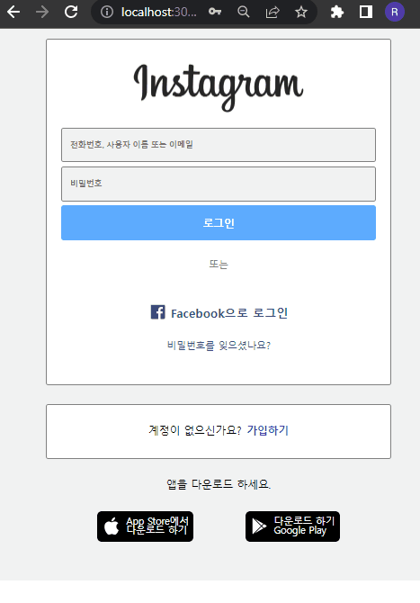

## 1. Login

<p align="center"></p>

```js
// context/auth.js
const [logInState, setLogInState] = useState(false);

const loginHandler = (id, pw) => {
  localStorage.setItem('isLoggedIn', '1');
  setLogInState(true);
};

const logoutHandler = () => {
  localStorage.removeItem('isLoggedIn');
  setLogInState(false);
};

useEffect(() => {
  if (localStorage.isLoggedIn === '1') {
    setLogInState(true);
  }
}, []);
```

1. **loginState**

   - 로그인 상태는 앱 전체에서 접근할 수 있어야 하는 데이터라고 생각했기 때문에, 이 상태를 긴 prop chain으로 전달하지 않기 위해 context를 이용하였다.

2. **useEffect**
   - localStorage에서 데이터를 읽는 작업은 side effect이므로 useEffect를 사용하였다.
   - 앱이 처음 실행될 때에만 로그인 여부를 확인하고, 상태를 업데이트하도록 Dependencies에 아이템을 전달하지 않았다.

## 2.GNB


```js
// mainPage
const MainPage = (props) => {
  return (
    <main>
      <Header />
      <Feeds />
    </main>
  );
};
```

```css
.header {
  border-bottom: 1px solid rgba(128, 128, 128, 0.349);
  background-color: white;
  position: sticky;
  top: 0;
}

.header-navbar {
  display: none;
}

@media screen and (min-width: 576px) {
  .header-navbar {
    display: block;
  }
}
```

1. 모바일을 기준으로 스타일링 코드를 먼저 작성하고, 576px 이상(모바일 가로 너비)일 때 navigation bar를 보여주도록 작성했다.
2. Header 컴포넌트에 sticky를 적용하여 main 태그를 기준으로 가장 상위에 헤더가 고정될 수 있도록 했다.

## 3. Validation

```js
// validation
const validEmail = new RegExp('^[a-zA-Z0-9._:$!%-]+@[a-zA-Z0-9.-]+.[a-zA-Z]$');
const validPassword = new RegExp(
  '^(?=.*[a-z])(?=.*[A-Z])(?=.*[0-9])(?=.*[!@#$%^&*])(?=.{8,})'
);

const checkIdValid = (input) => {
  return validEmail.test(input);
};

const checkPwValid = (input) => {
  return validPassword.test(input);
};
```

1. 정규 표현식을 이용해서 유효성 검사 코드를 작성해 본 것은 처음이라 구글링의 도움을 받았다.
2. 정규 표현식의 test라는 메서드가 너무 편해서 좋았다. ;-)

```js
// loginform
const idChangeHandler = (e) => {
  const idInput = e.target.value;
  const idValid = checkIdValid(idInput);
  setIdState({ value: idInput, isValid: idValid });
};

const pwChangeHandler = (e) => {
  const pwInput = e.target.value;
  const pwValid = checkPwValid(pwInput);
  setPwState({ value: pwInput, isValid: pwValid });
};
```

1. input 컴포넌트에 onChange 이벤트가 발생할 때 마다 유효성 검사를 진행하고, 그 결과를 state로 관리했다.
2. +) 사용자가 값을 새로 넣을 때 마다 유효성 검사를 하기 보다는 useEffect의 clean up 함수를 쓰는 방법이 더 좋을 것 같다.

```jsx
<input
  type="password"
  name="password"
  id="password"
  className={`${pwState.isValid === false ? style['invalid'] : ''}
     ${pwState.isValid === true ? styles['valid'] : ''}
  `}
  placeholder="비밀번호"
  required
  onChange={pwChangeHandler}
  ref={pwElement}
/>
```

- className을 동적으로 지정해서 유효성 검사 결과에 따라 다른 스타일링을 적용하였다.

## 4. Routing

## 5. Feeds

<p align="center"></p>

```jsx
const [feeds, setFeeds] = useState([]);

useEffect(() => {
  fetch('data/data.json')
    .then((res) => res.json())
    .then((data) => setFeeds([...data.feeds]));
}, []);
```

- fetch를 이용해서 data를 받아오고, 이 데이터를 feeds state로 업데이트 했다.

```js
// commentInput
const commentInput = useRef();
const submitHandler = (e) => {
  e.preventDefault();

  const comment = commentInput.current.value;
  props.commentHandler({
    userName: 'qtre',
    contents: comment,
  });

  commentInput.current.value = '';
};

// Feed
const addCommentHandler = (comment) => {
  comment.key = Math.random().toString();
  setComments((prev) => [comment, ...prev]);
};
```

1. userName을 하드코딩하는 것 보다, 사용자의 id를 context로 관리해서 그 값을 전달하는 것이 더 좋을 것 같다.
2. prevState parameter를 이용해서 기존의 댓글 리스트 데이터가 업데이트 될 state에 포함되도록 하였다.
